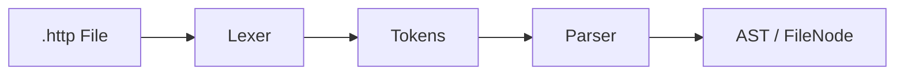
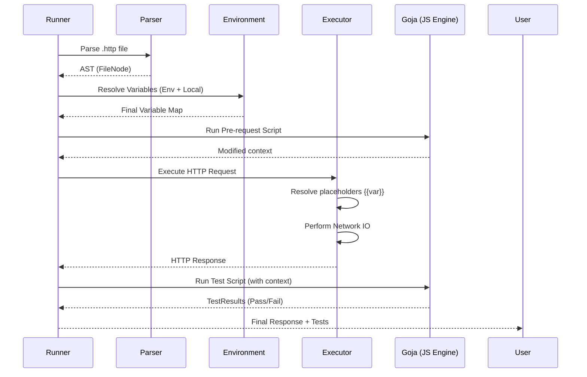

# Rester Architecture Documentation

This document provides a deep-dive into the internal architecture of Rester, covering the parser, execution engine, and storage models.

## 1. High-Level Overview

Rester is built on a hybrid architecture combining a high-performance Go backend with a modern React frontend, bridged by [Wails](https://wails.io/).

- **Backend**: Go (Services, Parser, Execution Engine, SQLite)
- **Frontend**: React + Vite (Zustand State Management, Monaco Editor)
- **Format**: Native `.http` files (JetBrains/VS Code compatible)

## 2. The Parser Engine

Rester uses a custom Hand-written Lexer and Parser to transform `.http` files into an Abstract Syntax Tree (AST). This allows for deep analysis, variable resolution, and script extraction without the fragility of regex-only parsing.

### Lexer -> Parser Pipeline

### Key Components:
- **Lexer**: A stateful scanner that emits tokens (Method, URL, Header, Body, Variable, Script).
- **Parser**: Consumes tokens and builds the `FileNode` structure. It supports multiple requests per file separated by `###`.
- **AST Nodes**: Defined in `backend/pkg/core/models.go` (`FileNode`, `RequestNode`, `VariableDef`).

## 3. Request Execution Lifecycle

The execution engine is designed to be UI-independent, allowing for the same logic to drive both the GUI and the Headless CLI.

### Execution Flow

## 4. Workspace & Storage Model

Rester follows a **Filesystem-as-Source-of-Truth** model.

### Workspace Structure:
- **Collections**: Mapped to physical directories.
- **Requests**: Mapped to `.http` files.
- **Environments**: Stored in `http-client.env.json`.
- **Secrets**: Stored in `.env` files (not committed to VCS).

### Storage Layers:
1. **Filesystem**: Stores all portable data (collections, requests, envs).
2. **SQLite**: Stores application-local state (last opened file, execution history, workspace metadata).

## 5. Frontend/Backend Communication

Rester uses a "Single Source of Truth" pattern in the frontend using **Zustand**.

- **Wails Bridge**: Handlers in `backend/handlers/` expose Go methods to Javascript.
- **State Sync**: The frontend calls Go handlers, and the response is used to update the global Zustand store, triggering React re-renders.

## 6. Extension Points

Rester is designed for extensibility:
- **New Protocols**: Add a new `ExecutionService` implementation (e.g., `GrpcExecutor`).
- **Custom Importers**: Implement the `Importer` interface (similar to the current `PostmanImporter`).
- **AST Evolution**: Add new nodes to `core.FileNode` for advanced metadata or protocol-specific fields.

## 7. Developer Onboarding

### Prerequisites:
- Go 1.21+
- Node.js 18+
- Wails CLI (`go install github.com/wailsapp/wails/v2/cmd/wails@latest`)

### Getting Started:
1. **Clone**: `git clone ...`
2. **Dev Mode**: `wails dev` (runs Go backend and Vite frontend with hot-reload).
3. **Build**: `wails build` (produces a production binary).

### Contribution Guidelines:
- Business logic goes in `backend/pkg/`.
- UI components go in `frontend/src/components/`.
- State logic goes in `frontend/src/state/`.
- Always update `specs/` for significant changes.
