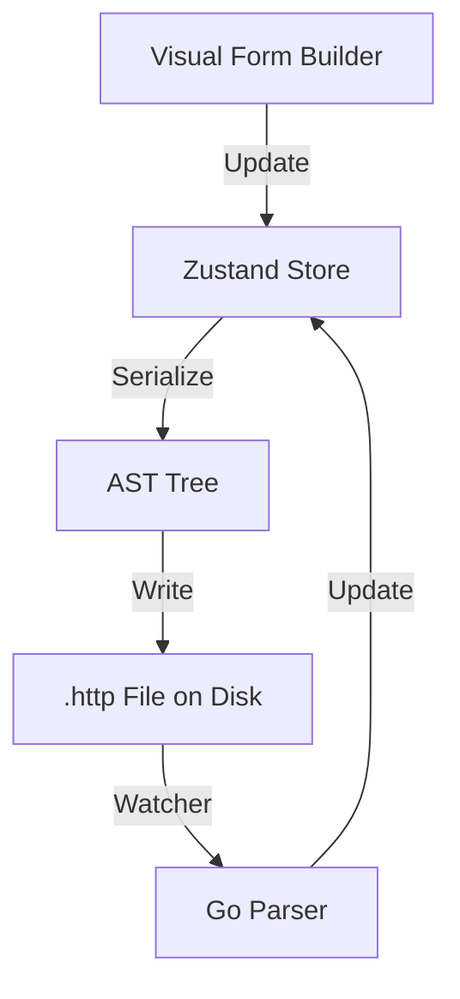

# Data Model: Visual-First API Workspace

## Core Entities

### 1. VisualDocument
- **Purpose**: The primary reactive state for the UI request builder.
- **Attributes**:
  - `ID`: Document identifier.
  - `Method`: HTTP Verb (GET, POST, etc.).
  - `URL`: Base URL string.
  - `Params`: List of `{key, value, active, description}`.
  - `Headers`: List of `{key, value, active, description}`.
  - `Auth`: Structured object (Type: Bearer, Basic, etc.).
  - `Body`: Structured object (Type: JSON, Multipart, etc.).
  - `RawBuffer`: The serialized .http text representation.

### 2. WorkspaceNode
- **Purpose**: Represents a file or folder in the visual explorer.
- **Attributes**:
  - `Type`: 'file' | 'folder'.
  - `Name`: Display name.
  - `Path`: Filesystem path.
  - `Children`: Recursive list for folders.

### 3. EnvironmentProfile
- **Purpose**: Visual management of variables.
- **Attributes**:
  - `Name`: Environment name.
  - `Variables`: List of `{key, value, secret}`.

## Synchronization Flow

## State Transitions

| Event | Action | UI Result |
|-------|--------|-----------|
| User types Param | Update `Params` list | URL bar updates in real-time |
| User selects Auth | Open Auth Drawer | `Auth` object populated; Headers updated |
| External Git Pull | FS Watcher detects change | Tab shows "File changed on disk" banner |
| Save | Flush `RawBuffer` to disk | `isDirty` flag cleared |
